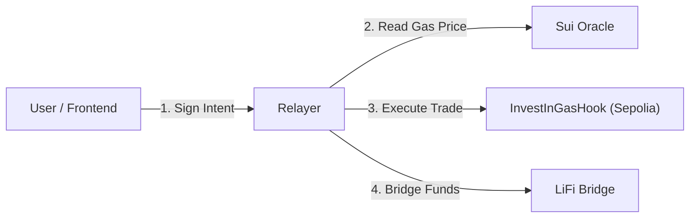

# InvestInGas Relayer v2

The **InvestInGas Relayer** is a critical infrastructure component that connects the frontend, the Uniswap v4 Hook (on Sepolia), and the Sui Gas Oracle. It enables users to purchase gas futures with signatures rather than direct contract interaction, providing a seamless UX.

## 🏗 Architecture



## Source Code (`src/`)

### `index.ts`
The main entry point for the Relayer service.
- **Express Server**: Hosts the API endpoints for the frontend.
- **Transaction Orchestration**: Manages the flow from user intent (signature) to on-chain execution.
- **Security**: Verifies EIP-712 signatures before submitting transactions.
- **CORS & Middleware**: Configured for cross-origin requests from the frontend.

### `evm-client.ts`
The interface for interacting with the EVM-based smart contracts.
- **Hook Interaction**: Calls `purchasePosition` and `redeemPosition` on the `InvestInGasHook`.
- **EIP-712 Verification**: Contains logic to recover signers from user purchase/redeem intents.
- **Position Tracking**: Efficiently fetches and filters NFT positions for specific users.

### `lifi-client.ts`
Integrates with the LiFi SDK to handle cross-chain logistics.
- **Quote Selection**: Fetches optimal bridging quotes for delivering native gas to target chains.
- **Calldata Generation**: Generates the necessary low-level data for the `LiFiBridger` to execute cross-chain swaps.
- **Same-Chain Detection**: Intelligently handles "redemptions" to the same chain without unnecessary bridging.

### `sui-reader.ts`
The bridge to the Sui Gas Oracle.
- **Dynamic Field Lookup**: Reads real-time gas price data from the Sui `Table` storage.
- **Format Conversion**: Converts raw wei values (u128) from Sui into human-readable gwei for the frontend.
- **Multi-Chain Aggregation**: Fetches and aggregates prices for all supported EVM chains in one call.

## 🚀 Quick Start

### 1. Prerequisites
- Node.js v18+
- Wallet with **Sepolia ETH** (for gas fees).
- Deployed `InvestInGasHook` and `LiFiBridger` contracts.
- Valid `Sui Oracle Object ID` (deployed on Sui Testnet).

### 2. Installation
```bash
# Install dependencies
npm install

# Build the project
npm run build
```

### 3. Configuration
Copy the example environment file:
```bash
cp .env.example .env
```

Edit `.env` and fill in the required values:
```ini
EVM_RPC_URL=https://sepolia.infura.io/v3/YOUR_KEY
RELAYER_PRIVATE_KEY=your_private_key_here

HOOK_ADDRESS=0x...      
BRIDGER_ADDRESS=0x...   

SUI_NETWORK=testnet
SUI_ORACLE_OBJECT_ID=0x... 
```

### 4. Running the Relayer
```bash
npm start

# For development (auto-reload)
npm run dev
```

## 📡 API Endpoints

| Endpoint | Method | Description |
|----------|--------|-------------|
| **Health** | | |
| `/health` | GET | Check relayer status, version, and authorization |
| **Market Data** | | |
| `/api/prices` | GET | Fetch all gas prices from Sui Oracle |
| `/api/prices/:chain` | GET | Fetch specific chain price and staleness check |
| `/api/lifi/chains` | GET | List all chains supported for cross-chain delivery |
| `/api/lifi/quote` | GET | Get a bridge quote for a specific redemption |
| **User Data** | | |
| `/api/positions/:user` | GET | List user's active/expired gas positions |
| `/api/positions/token/:id`| GET | Get detailed data for a specific position ID |
| **Actions** | | |
| `/api/purchase` | POST | Execute a purchase (requires signature) |
| `/api/redeem` | POST | Redeem a position (requires signature) |

## 🔐 Authorization
For the relayer to work, the wallet associated with `RELAYER_PRIVATE_KEY` must be authorized on the Hook contract.

**Fix:** Call `setRelayer(YOUR_RELAYER_ADDRESS)` on the `InvestInGasHook` contract using the contract owner's wallet.

